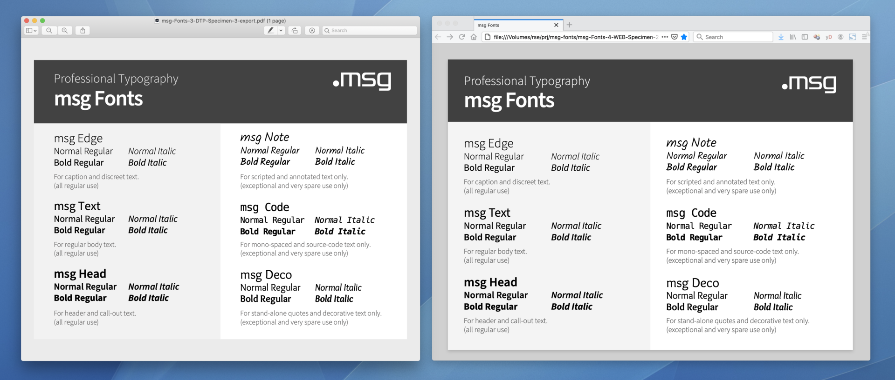

msg Fonts
=========

Created: 2015-09-05 
Modified: 2019-11-20

Challenge
---------

The [msg group](https://www.msg.group/) wants to use professional typography in the following 
four usage contexts:

- *Adobe Creative Suite* products (Photoshop, Illustrator, InDesign)
- *Micosoft Office* products (PowerPoint, Word)
- *HTML5 Single-Page-Applications* (SPA)
- *Web-Sites*

For this, professional fonts are required which cover the following
four major use cases:

- *Text*: For regular body and headline text. (all regular use) 
- *Signal*: For signal and call-out text. (all regular use) 
- *Code*: For mono-spaced and source-code text only. (exceptional and very spare use only) 
- *Note*: For scripted and annotated text only. (exceptional and very spare use only) 

Solution
--------

As most commercial fonts cannot be used unrestricted (especially when
it comes to embedding the font and wide spreading the results), Open
Source licensed fonts are used. The [TypoPRO](http://typopro.org/)
project provides an extensive and hand-collected set of those fonts.
Inspired by TypoPRO, we have chosen 16 individual fonts to cover the
above four major use cases and prepared the fonts for the above four
usage contexts. The font sources are:

- Adobe Source Sans Pro 3.006 (2019-09) 
  https://adobe-fonts.github.io/source-sans-pro/ 
  https://github.com/adobe-fonts/source-sans-pro/ 
  Open Font License 1.1

- Adobe Source Code Pro 2.030/1.050 (2016-07) 
  https://adobe-fonts.github.io/source-code-pro/ 
  https://github.com/adobe-fonts/source-code-pro 
  Open Font License 1.1

- Kalam 1.020 (2014)
  http://www.google.com/fonts/specimen/Kalam 
  http://www.google.com/fonts#UsePlace:use/Collection:Kalam 
  Open Font License 1.1

The particular preparation consists of mapping font family names, font
weights and font styles in the following way:

    --------------------------------    -----------------------------
    SOURCE:                             TARGET:
    --------------- -------- -------    -------------- ------ -------
    Family          Weight   Style      Family         Weight Style
    --------------- -------- -------    -------------- ------ -------
    Source Sans Pro Light    Regular    msg CI Text    Normal Regular
    Source Sans Pro Light    Italic     msg CI Text    Normal Italic
    Source Sans Pro Normal   Regular    msg CI Text    Bold   Regular
    Source Sans Pro Normal   Italic     msg CI Text    Bold   Italic
    --------------- -------- -------    -------------- ------ -------
    Source Sans Pro Semibold Regular    msg CI Signal  Normal Regular
    Source Sans Pro Semibold Italic     msg CI Signal  Normal Italic
    Source Sans Pro Bold     Regular    msg CI Signal  Bold   Regular
    Source Sans Pro Bold     Italic     msg CI Signal  Bold   Italic
    --------------- -------- -------    -------------- ------ -------
    Source Code Pro Light    Regular    msg CS Code    Normal Regular
    Source Code Pro Light    Italic     msg CS Code    Normal Italic
    Source Code Pro Normal   Regular    msg CS Code    Bold   Regular
    Source Code Pro Normal   Italic     msg CS Code    Bold   Italic
    --------------- -------- -------    -------------- ------ -------
    Kalam           Light    Regular    msg CS Note    Normal Regular
    Kalam           Normal   Regular    msg CS Note    Bold   Regular
    Kalam           Light    Regular    msg CS Note    Normal Italic
    Kalam           Normal   Regular    msg CS Note    Bold   Italic
    --------------- -------- -------    -------------- ------ -------

Notice the following points here:

- The msg group wants to use a typographically light appearance, so
  the font weights were "shifted down": the original light weight became
  the normal weight and similar for the other weights.

- The distinction between the two sets Corporate Identity (CI) and
  Corporate Specialty (CS) was made to indicate that the fonts in the CI
  set are intended for regular use while those in the CS set are really
  "special" and hence should be used only in exceptional cases only.

- The "msg CS Note" font family actually uses the font family Kalam twice:
  once for the regular style and once again for the italic style. The
  reason is that there is no suitable script font which includes both
  regular and italic style as the regular style of a script font usually
  is already "italic" or oblique.

- The above mapping results in exactly four fonts per font family to ensure
  the resulting fonts can be easily used even in the Microsoft Office 2016
  products where under Windows one can only choose the font family
  and then just optionally enable bold weight and/or italic style.

Results
-------

- Stage 1: 
  Here we downloaded the individual source font files.

    - `msg-Fonts-1-SRC/*`: 
      The downloaded font files.

    - `msg-Fonts-1-SRC-Downloads.txt`: 
      The download URLs.

- Stage 2:
  Here we converted the fonts according to the above preparation.

    - `msg-Fonts-2-GEN/*`: 
      The patch files for changing the font files in batch.

    - `msg-Fonts-2-GEN-Conversion.sh`: 
      The batch script for the conversion/preparation procedure.

- Stage 3:
  Here we provide the resulting fonts for Desktop Publishing (DTP) with
  the two usage contexts *Adobe Creative Suite* products (Photoshop,
  Illustrator, InDesign) and *Micosoft Office* products (PowerPoint,
  Word).

    - `msg-Fonts-3-DTP/*`: 
      The individual resulting font files.

    - `msg-Fonts-3-DTP-Windows-System-Install.bat`, 
      `msg-Fonts-3-DTP-Windows-System-Uninstall.bat`, 
      `msg-Fonts-3-DTP-Windows-User-Install.bat`, 
      `msg-Fonts-3-DTP-Windows-User-Uninstall.bat`, 
      `msg-Fonts-3-DTP-Windows-Util.ps1`: 
      The batch scripts to install/uninstall the DTP fonts under
      Windows, either locally for the current user or globally for the
      system (required administrator privileges).

    - `msg-Fonts-3-DTP-macOS-System-Install.bat`, 
      `msg-Fonts-3-DTP-macOS-System-Uninstall.bat`, 
      `msg-Fonts-3-DTP-macOS-User-Install.bat`, 
      `msg-Fonts-3-DTP-macOS-User-Uninstall.bat`: 
      The batch scripts to install/uninstall the DTP fonts under
      macOS, either locally for the current user or globally for the
      system (required administrator privileges).

    - `msg-Fonts-3-DTP-Specimen-1-refer.pptx`: 
      The font specimen in PowerPoint format, referencing installed fonts.

    - `msg-Fonts-3-DTP-Specimen-2-embed.pptx`: 
      The font specimen in PowerPoint format, embedding the fonts.

    - `msg-Fonts-3-DTP-Specimen-3-export.pdf`: 
      The font specimen in exported PDF format.

- Stage 4:
  Here we provide the resulting fonts for the Web and the
  two usage contexts *HTML5 Single-Page-Applications* (SPA) and *Web-Sites*.

    - `msg-Fonts-4-WEB`: 
      The individual resulting font files.

    - `msg-Fonts-4-WEB-Specimen-1-refer.html`: 
      The font specimen in HTML format, referencing local fonts.

    - `msg-Fonts-4-WEB-Specimen-2-embed.html`: 
      The font specimen in HTML format, embedding the fonts.

    - `msg-Fonts-4-WEB-Specimen-3-export.pdf`: 
      The font specimen in exported PDF format.

Author
------

Dr. Ralf S. Engelschall 
Director msg Applied Technology Research 
ralf.engelschall@msg.group

